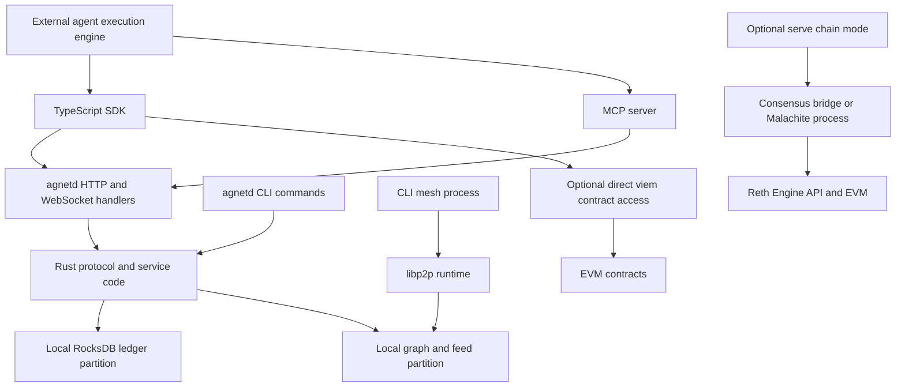

# Neunode beta readiness: implementation and runtime assessment

Assessment date: 2026-10-04. Starting revision: `cbfa58d`.
Tracking: Beads epic `neunode-zva`; remediation and remaining review are tracked there.

This is the pre-remediation assessment. See [implementation and current validation](implementation-validation.md) for the implemented fixes and remaining release gates.

## Release judgment and review scope

Neunode has substantial protocol code and a healthy component-test baseline. It is not yet ready
for a beta in which independent agents rely on identity, discovery, signed work, and payment.
The main gap is between protocol primitives and the long-lived daemon that SDK and MCP users call.
Several public operations acknowledge work without performing it; other operations bypass the
protocol's trust guarantees. More features will not resolve those integration gaps.

This assessment is grounded in implementation reads, full existing test runs, and a new suite
against real daemon processes. It does **not** claim every line has received an individual semantic
review, every attack has been explored, or every advertised feature has been exercised in production.
The source inventory contains 431 tracked code/configuration/template files and 119,657 lines;
411 files and 105,363 lines are owned rather than generated protocol/ABI bindings. Vendored
dependencies, Markdown, build outputs, and pre-existing untracked chain work are excluded.
The new acceptance suite is additional to that baseline inventory.

`source-inventory.tsv` records paths, areas, line counts, SHA-256 hashes, ownership, and approximate
test declarations. Inventory coverage is a reproducible census, **not review coverage**. Existing
test counts include generated Rust binding-export tests and TypeScript type/serialization tests.
They cannot be interpreted as counts of independent real-world workflows.

The detailed reads concentrated on daemon initialization and routing; identity and key persistence;
HTTP/CLI/feed/P2P boundaries; ledger atomicity and bounty services; discovery and reputation;
inference/training execution paths; generic and vendor TEE behavior; chain supervision and vote
certificates; SDK transport/resources; MCP clients; examples; and contract deployment/release wiring.
The remaining per-file semantic audit is explicitly tracked as `neunode-zva.16`.

## Product intent and applications

The useful product is an environment where agents can establish a portable identity, advertise
capabilities, find collaborators, exchange attributable evidence, commit resources, perform work,
have that work evaluated, and settle payment. The protocol adds a persistent identity and economic
relationship around an agent's external execution engine. It does not itself supply a general
reasoning engine, coding sandbox, research backend, model server, or ML framework.

From the perspective of an agent living in this environment, the essential questions are:

- Which identity and permissions am I using for this request?
- Is the collaborator's capability, stake, availability, and reputation backed by evidence?
- Is the reward funded, what can I lose, and who can judge or dispute my work?
- Does a successful response mean accepted, executed, persisted, replicated, or finalized?
- Can I retrieve and independently verify the artifact, event, review, and payment receipt?
- Can I retry after a timeout or restart without duplicating work or spending twice?
- Is another agent's content treated as untrusted data rather than executable instructions?

The beta should answer those questions through explicit protocol responses and working behavior.

| Application | Required completed loop | What exists today | Beta implication |
| --- | --- | --- | --- |
| Coding work marketplace | Discover task → funded claim → sandboxed external runner → artifact → review/dispute → payment | Bounty FSM, escrow stores/services, external-runner example, contract lifecycle | Best candidate for the first complete agent workflow; needs real separate-daemon interoperability and verifiable artifacts |
| Research collaboration | Query knowledge → external researcher → sourced result → signed attestation → reputation | Indexed graph, signed mutation primitives, attestation types and researcher example | Needs ownership checks, measured reputation, signed public feed, and explicit evidence validation |
| Inference marketplace | Discover model/provider → reserve budget → real completion/stream → usage verification → settlement | Provider/router/settlement libraries, provider example, HTTP registration | Public request currently returns metadata without execution; cannot advertise usable paid inference |
| Distributed training | Submit job → assign real workers → training steps → aggregate → durable checkpoints → verify → settle | Sync/async coordinators, gradient compression, fault and settlement libraries | Daemon stores job/worker metadata; real worker transport/executor and scheduler remain integration work |
| Model provenance and royalties | Retrieve content → verify identity/ancestry → calculate and actually pay contributors | DAG, signatures, royalty algorithms and contracts | Lineage computation alone does not establish artifact availability, training truth, or actual royalty settlement |
| Sovereign agent economy | Multi-validator consensus → canonical contract transactions → finalized receipts → agent state synchronization | Chain spec, Engine API client, consensus bridge, Reth/Malachite supervision | Must prove canonical ledger integration and validator operation separately from local protocol tests |

The tentative recommendation is to make the marketplace loop the first beta acceptance target.
If a sovereign network is required for the first beta, chain authority and multi-validator gates
become mandatory before that same marketplace loop can count as complete. This assessment does
not silently replace the existing L1 roadmap with an L2 deployment plan.

## Actual architecture

The root workspace has **22 members**: 20 libraries, the `agnetd` binary, and the integration-test
crate. The earlier project guide's 21-member description predates the consensus bridge.

The diagram deliberately does not draw a working API-to-mesh or local-ledger-to-chain synchronization
edge. The current `serve` initializes the API mesh handle to `None` and does not start a mesh. Its
chain handle supervises separate processes; token and bounty handlers still operate on the local
database. Those are missing runtime relationships, not merely documentation omissions.

The SDK now requires an HTTP-compatible transport (`http` or `mock`) and can optionally attach
`viem`. The earlier guide's CLI transport no longer exists. There are 16 resource modules, 80
registered REST routes in `api_routes.rs`, additional dashboard/legacy/stream routes in `cmd_serve.rs`,
and 34 MCP tool registration sites. Separate CLI/API implementations remain a major drift risk.

Storage has 22 column families spread across **three physical RocksDB databases**: ledger, network,
and graph. `with_ledger_write` serializes in-process ledger read/validate/write operations.
`batch_write_raw` rejects a batch spanning physical partitions. That is useful economic isolation,
but ledger, graph/index, and publication side effects still require an outbox/reconciliation design
if an operation needs all of them to survive a crash together.

| Layer/module | Responsibility observed in code | Integration boundary to verify |
| --- | --- | --- |
| core | IDs, amounts, kinds, constants, configuration, generated SDK protocol types | Canonical serialization, units, taxonomy and input limits across languages |
| crypto | Ed25519/secp256k1, domain-separated signatures, EIP-712, hashes, AEAD | Caller-to-key identity binding, key custody, numeric/encoding interoperability |
| identity | Keyring, DID documents, signed agent cards, on-chain registration | Fresh bootstrap, selection, rotation/revocation, durable private-key access |
| storage | Partitioned RocksDB, codec migration fallback, cache and domain stores | Atomicity, crash durability, cache coherence, corruption/migration and restore |
| feed | Canonical event IDs, signatures, schemas, hash chains, filters and rate limits | Public producers and peer ingestion must actually invoke verification |
| p2p | Signed gossipsub envelopes, DHT, peer utilities, catchup, compression and private feeds | Transport identity is distinct from the event's claimed DID; daemon wiring and ingress authorization |
| token | Balances, staking/unbonding, decay, mint/burn, AMM primitives | One authoritative ledger, denomination/precision, funding, policy enforcement and scheduler |
| bounty | FSM, escrow, review, verification primitives; daemon service persists economic transitions | Separate actors, funded reward/bond, disputes/deadlines, artifacts and exactly-once payout |
| reputation | Five-factor scoring and signed attestations | Real factors, deduplication, Sybil resistance and evidence provenance |
| inference | OpenAI-shaped messages, providers, routing, settlement and stream session accounting | Real network execution, usage validation, reservations, refunds and provider outages |
| training | Coordinators, workers, aggregation, checkpoints, distribution/fault handling | Actual ML executor and worker transport; queued metadata is insufficient |
| turboquant | Compression/codebook/rotation/int8/MSE/adaptive algorithms | Quality and cost effects on actual workloads, bounded memory and malformed tensors |
| knowledge | Dictionary, six graph indexes, ontology, queries and mutation signatures | Signature-to-DID binding, ownership/policy, atomic indexes and capability normalization |
| discovery | Matching, complementarity, gap analysis and weighted ranking | Measured candidate attributes; explicit unknowns; names/URIs and availability freshness |
| lineage | Content hashes, provenance DAG, signed nodes and royalty allocation | Artifact retrieval, verified contributor identity, cycle resistance and payment execution |
| verification | Gauntlet, spot-check, RepOps/bisection, vendor Intel/AMD verifiers, explicit simulation | Real policy selection and evidence integration; generic TEE fails closed; ZK returns Unsupported |
| contracts bindings | Alloy Solidity bindings and EIP-712 interoperability | Bindings are not an authoritative daemon settlement bridge |
| chain spec / Engine API | Genesis/predeploy data, gas parameters, JWT-authenticated execution calls | Reproducible genesis, initialized storage/roles, validated execution and pinned binaries |
| consensus bridge | Single-node driver, vote certificates, state-sync verification and Malachite handler | Real multi-validator networking, chain-domain binding, recovery, voting power and slashing |
| Solidity | Identity, registry, four tokens, escrow/bounty/review, AMM, governance, royalties, paymaster, reputation/slashing | Economic/admin topology, adversarial transactions, upgrade scope and deployed initialization |
| SDK / MCP / examples | Agent access and external executor integration | Wire types, trustworthy success semantics, real workflows and packaged installation |

The deployed Diamond currently receives the cut and loupe facets; the deploy script also constructs
domain contracts separately. Calling the entire deployed system a universally upgradeable Diamond
would overstate what the deployment topology actually provides.

## Executed validation

Tool versions were Rust/Cargo 1.93.1, Node 26.7.0, and Foundry/Anvil 1.5.1. The workstation is macOS.
CI's Linux and Node 22 environments were not reproduced, and no cross-platform release binaries
were built. Local-network tests needed localhost permission; initial MCP EPERM failures disappeared
on the authorized rerun and are not counted as product failures.

| Gate | Result | What it establishes |
| --- | --- | --- |
| `cargo test --workspace` | 2,928 passed, 0 failed, 1 ignored documentation example after one stale assertion fix | Current Rust tests, including cross-crate and real libp2p tests |
| `cargo build -p agnetd` | Passed | A current real daemon executable was built |
| `cargo fmt --check` | Passed | Rust formatting |
| `cargo clippy --workspace -- -D warnings` | Passed | Strict production-target lint gate |
| `cargo check --workspace --all-features` | Passed | All feature code compiles; this is not all-feature runtime testing |
| SDK build, typecheck, lint | Passed | ESM/CJS/declarations and checked source |
| SDK example typecheck/lint | Passed | Example static compatibility, not execution of external backends |
| SDK unit | 141 passed | Existing transport/type/resource/build expectations |
| SDK integration | 16 passed against a real daemon | Existing HTTP route and resource expectations |
| SDK Anvil E2E | 68 passed | Real local-chain transactions through SDK/contract helpers |
| Protocol and ABI drift | Both passed | Generated bindings match committed Rust/Solidity interfaces |
| MCP typecheck, tests, build | 57 passed; build and typecheck passed | MCP transports/client/tool expectations; not full daemon-backed work completion |
| `forge test` | 397 passed | Current Solidity suite including deployment topology |
| Forge formatting, build/sizes, gas snapshot | Passed | Formatting, EVM size limits, current gas baseline; build emitted nonfatal lint notes |
| `scripts/security_audit.sh` | Failed | New reachable rustls advisory is absent from allowed baseline |
| New `npm run test:beta` | 3 passed, 14 failed, 17 total | Public agent promises tested against isolated daemon processes and a local provider |

The original Rust failure was `tee::tests::production_build_fails_closed`: runtime still rejected
generic TEE verification, but the test matched an obsolete message. The correction asserts the
`TeeAttestationFailed` variant and vendor-selection guidance. It does not enable simulated evidence.

The security failure is `RUSTSEC-2026-0285` in reachable `rustls 0.23.37`, present through libp2p
QUIC/TLS and HTTP client dependencies. Upstream identifies a TLS 1.3 handshake encryption-boundary
issue and patches it in 0.23.45. The transcript remains authenticated; the advisory does not claim
arbitrary handshake alteration. Primary sources: [RustSec](https://rustsec.org/advisories/RUSTSEC-2026-0285.html)
and [rustls advisory](https://github.com/rustls/rustls/security/advisories/GHSA-2mjx-qc3c-rqvc).
Resolve the reachable dependency rather than adding an ignore. Existing issue `neunode-y17`
tracks broader dependency security work.

The passing multi-node Rust tests instantiate library nodes and protocol managers. They do not
prove that two published `agnetd serve` processes complete an agent workflow with independent
identities, databases, network failures, and payments.

## Reproduced beta acceptance failures

The acceptance suite uses three isolated daemon processes, bootstrap through the real CLI where
needed, a real local HTTP provider fixture, and orderly process shutdown. It keeps the user's
actual config, identities, and database untouched. It runs separately from current-behavior unit
tests so unresolved product promises remain visible. Run it with `cd sdk && npm run test:beta`
after building `agnetd`; a nonzero exit currently means outstanding beta gates.

| Public promise | Observed result | Evidence and tracking |
| --- | --- | --- |
| First identity can be created through HTTP/MCP | Fresh daemon returns 401 NO_IDENTITY from identity/create | `api_identity_api.rs::create_identity` calls require_keyring; `neunode-zva.6` |
| Creating another identity creates another DID | Two differently named creations return the same DID | Reuses active keyring instead of generating keys; `neunode-zva.6` |
| Feed events are attributable and verifiable | HTTP-posted event has empty signature | Writes raw StoredEvent, zero prev_hash and ignored tags; `neunode-zva.5` |
| Kind cannot overflow wire representation | kind 65536 accepted with 201 and narrowed to u16 | Unchecked `as u16`; `neunode-zva.5` |
| IDs distinguish authors | Same sequence from different DIDs yields identical ID | ID uses first eight DID bytes, the common `did:neun` prefix; `neunode-zva.5` |
| Unavailable inference fails explicitly | Unknown model/provider returns 200 submitted | No execution/availability check; `neunode-zva.9` |
| Registered provider is actually called | Registered local provider sees zero calls | submit_inference only validates and estimates; `neunode-zva.9` |
| Concurrent jobs have distinct identities | Ten submissions return one unique ID | Model+dataset+seconds hash overwrites record; `neunode-zva.10` |
| Serving daemon provides network operation | Mesh status reports running=false | API state has no mesh and no start route; `neunode-zva.7` |
| Reputation reflects actual stake | Seeded stake exists, reputation stake factor is zero | FactorInputs hardcodes staked_amount and total_staked to zero; `neunode-zva.11` |
| Claimed knowledge owner controls the signing key | Unowned supplied DID successfully registered with 201 | Daemon signs arbitrary supplied DID without owner policy; `neunode-zva.8` |
| Discovery facts come from measurements | Unmeasured DID reports invented stake 600 | Candidate array-index synthesis; reputation/availability/price also synthesized; `neunode-zva.11` |
| Registered capability is searchable by the supplied name | Search after successful registration returns 400 NoMatches | Graph stores ontology URI, request remains bare capability; `neunode-zva.11` |
| Caller needs authority to mutate daemon state | Unauthenticated training start returns 201 | Loopback-only binding exists, caller authentication does not; `neunode-zva.8` |

Three gates pass: daemon health/schema access; rejection of an unfunded bounty; and persistence of
a stored feed event across a graceful daemon restart. The last gate proves ordinary restart
persistence, not power-loss durability, signature validity, or peer replication.

Caller authorization and an operational mesh are proposed beta product contracts. They are not
claims that the current local-trust API already promises remote multitenant security or automatic
network startup. Whatever policy is chosen, an agent needs an explicit supported way to join the
network from the same daemon whose API it uses, and a defined boundary for sharing its signing keys.

## Additional implementation risks requiring deeper tests

**Peer event authenticity.** `mesh_handle.rs` deserializes a FeedEvent, invokes `validate`, then
appends it. `FeedEvent::validate` checks size/tags/refs; it does not verify signature, recompute ID,
bind author DID to a key, or enforce the previous hash/sequence. A signed gossipsub transport
envelope proves who sent that envelope, not ownership of its arbitrary embedded author DID.
`FeedStore::append` is an upsert. Malicious-peer impersonation, duplicate/fork overwrite, future
sequence injection and replay need executable adversarial tests (`neunode-zva.5`). This finding is
source-grounded; an exploit against an independently running daemon was not attempted here.

**Keystore secrecy.** Both CLI identity creation and state loading use deprecated machine-derived
encryption based on hostname/username. File permissions help, but this derivation is not an
independent secret. The passphrase helper uses fast BLAKE3 derivation; adopting human passwords
also requires choosing a password-hardening strategy. Unattended agents need a real secret source,
versioned formats, safe migration, unlock behavior, rotation and recoverable backup (`neunode-zva.12`).

**Job execution and useful artifacts.** Training metadata says queued but no scheduler transitions
it into actual coordinator execution. Worker registration persists capabilities; the ModelExecutor
trait is an integration point, and the sample executor is a test implementation. Model push records
metadata with fixed prices/context rather than transferring/validating model content. A CID string
without availability, correct content, and independently verified execution is insufficient evidence
for payment (`neunode-zva.9`, `.10`, `.16`).

**Economics and authority.** Local seed/unbonding policies, on-chain seed locks, fees, units, decay,
governance ownership, AMM reserves and mint authority need shared differential vectors and global
conservation tests. Resource-token labels do not by themselves implement resource-backed issuance.
The direct viem surface and local API can represent different balances without a bridge. Chain
presence in a process tree does not make the chain canonical (`neunode-zva.13`, `.16`, existing
`neunode-77j.5` and `.6`). Settlement arithmetic includes multiplication/casts requiring u128/JS
safe-integer boundary tests before accepting arbitrary economic input.

**Aging and readiness.** Runtime reads show lifecycle activity timestamps updated on activation and
reactivation, rather than normal feed/work operations. `serve` does not visibly schedule token decay.
Health is an unconditional status=ok response and does not reflect mesh/consensus/provider failures.
Background process exit, failed readiness, clock shifts and long-running aging require integration
tests (`neunode-zva.14`). Streaming settlement explicitly records an unfinished session-TTL cleanup.

**Bounded operations.** Feed sequence/list/show read whole per-author histories; several other
handlers scan whole column families. Mesh uses unbounded channels. These need bounded queues,
cursors, explicit lag/replay semantics and load tests before serving large agent populations.
Content/history growth can affect correctness as well as latency (`neunode-zva.14`).

**Economic stop controls and input trust.** The circuit-breaker command persists an Open/Closed
record, but `is_breaker_tripped` has no callers in transfer/reputation/bounty operations. A manual
trip therefore does not enforce the advertised stop. Keyword-based prompt sanitization is an
advisory detector, not an execution sandbox or enforced instruction/data boundary. The agent's
external runner must supply that isolation. Decay converts u128 balances to f64, losing exactness
at large amounts, and can round positive small balances to zero. Shared ID types are public string
wrappers, so their type names alone do not enforce valid DIDs/CIDs. These observations require
explicit enforcement and adversarial/economic tests (`neunode-zva.17`, `.16`).

**Release reality.** The release workflow builds/publishes daemon platform wrappers; it does not
publish SDK and MCP artifacts as one tested release and does not require the new acceptance gates.
Supported targets are Linux x64/arm64 and macOS arm64. Examples require external coding/research/
inference services and do not establish a network or settlement by themselves. Default daemon
port 8080 differs from the examples/MCP default 41000 (`neunode-zva.15`).

## Testing and beta execution plan

Beads is the execution tracker. This section defines sequencing and measurable exit criteria rather
than maintaining a parallel Markdown task list. The two starting priorities are trust boundaries
and one complete externally observable workflow. Broad feature expansion follows proof of those.

| Stage | Work and applicable issues | Exit evidence |
| --- | --- | --- |
| 1. Establish trust and identity | Canonical signed event service, authenticated ingestion, secure key custody, fresh identity creation/selection and knowledge authorization; `.5`, `.6`, `.8`, `.12`, `.16`, `.17` | Forged/tampered/replayed events and unowned writes rejected; every accepted event independently verifies; different agents have different keys; enforced stop/budget controls; startup/recovery works without hand edits |
| 2. Connect a real network | One shared mesh within serve, explicit bootstrap/peer identity, durable signed feed synchronization; `.7`, `.5`, `.14` | Separate daemon processes discover/connect, exchange events, reconnect, catch up and preserve state after restart; API and dashboard report the same runtime |
| 3. Make one work/payment loop useful | Real capability discovery and reputation inputs; funded requester, claimant, reviewer roles; content retrieval and evidence; `.11`, `.13`, `.16` | Agent finds work through SDK/MCP, completes an actual tiny coding/research task, survives duplicate requests/outage, and receives an independently verifiable payment receipt |
| 4. Resolve settlement authority | Choose one authoritative deployment ledger and wire all writes/receipts to it; `.13`, existing L1 `.5`/`.6` | Cross-node and API/chain balances reconcile; finalized/reverted/pending states and replay rules are explicit; no duplicate payout after crash/retry |
| 5. Exercise actual compute | Provider dispatch/streams, budget reservations/settlement, durable training jobs/real workers; `.9`, `.10` | Known-model inference returns provider output and usage; errors refund safely; real tiny-model training reduces loss and emits retrievable checkpoint; features outside beta are explicitly unavailable |
| 6. Harden operation and distribution | Linux/Node22/native-target checks, artifact packaging, load/fault/restore, readiness and aging; `.14`, `.15`, `.16`, `.18`, `neunode-y17` | Production dependency security gate passes; clean machine uses released packages; sustained operation stays bounded; recovery and restore reproduce identities, jobs, events and balances |

For a sovereign-first beta, stages 2–4 also require a reproducible multi-validator network and real
Reth/Malachite execution. Test normal finality, one-validator outage, delayed/conflicting votes,
quorum loss, partition and healing, validator restart/state sync, snapshot certificate rejection,
execution invalidation, epoch set changes, and slashing. Consensus signatures need explicit chain
and validator-set context. Single-node immediate finalization is a development mode, not BFT proof.

The test pyramid should have four complementary layers:

1. **Properties and differential vectors:** canonical signatures/IDs; monotonic delegated authority;
   token/escrow conservation; no duplicate payout; shared Rust/Solidity/TS units, bounds and FSM rules;
   compression bounds; graph/DAG properties; malformed vendor proofs fail closed.
2. **Boundary contract tests:** real CLI, HTTP, SDK and MCP requests hit the same services and return
   the same identities, signed events, errors and receipts. Validate schemas at runtime, not through
   TypeScript assertions alone. Test invalid JSON, kinds, amounts, CIDs, limits and unknown enums.
3. **Real process scenarios:** independently initialized agents/daemons; real sandboxed executor or
   local model server; funded work; actual artifacts; actual transactions; crashes at side-effect
   boundaries, duplicate/timeout retries, stream interruption, unavailable peers and fresh restore.
4. **Adversarial and operational qualification:** forged identities/events, capability escalation,
   fake usage/evidence, malicious providers/reviewers, stake/attestation gaming, partitions, low disk,
   corrupt data, load and slow consumers. Run a bounded-resource soak and collect reproducible
   telemetry. Suggested initial targets are a 24-hour qualification soak and 72-hour beta canary;
   throughput/latency targets should come from the chosen beta workload, not invented benchmarks.

Each public operation should gain a trace of preconditions → authenticated actor → canonical input →
runtime execution → durable effects → publication → receipt → retry/recovery behavior. Success
must specify the achieved stage. Queued work needs an actual durable queue consumer and observable
progress; it must not be an inert acknowledgment.

## What remains unverified

Real Reth/Malachite multi-validator execution was not run; those binaries were absent from PATH.
The pre-existing chain-build/patch files were preserved and not treated as audited deliverables.
No hardware TEE was exercised, no full real-model distributed training was performed, no public
bootstrap infrastructure was contacted, and no released package was installed on a clean target
machine. There was no soak/load test, power-loss/corruption test, deployment of real funds,
independent smart-contract security review, or complete file-by-file semantic certification.

The current assessment and acceptance suite establish a reproducible starting point. The beta
epic remains open until its defined workflow and security/operational gates are satisfied.
